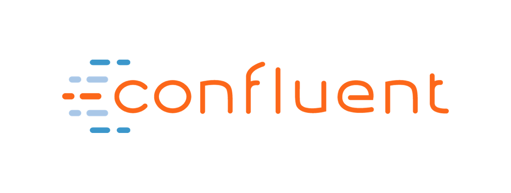

theme: XebiCon19
slidenumbers: true

# Flutter en 5 min

[.slidenumbers: false]
[.footer-style: #fff, alignment(right)]
[.footer: XebiCon19 | @benjlacroix | @XebiConFr | #XebiCon19]

---

[.header: #595959, alignment(left), line-height(1), Oswald]
[.footer-style: #fff, alignment(left)]
[.footer: @benjlacroix]

# Qui suis-je ?

*Benjamin* Lacroix
Développeur Android (et Flutter)
6 ans à Xebia

---

[.header: #595959, alignment(left), line-height(1), Oswald]

# Plan

- Flutter
- *Dart*
- Expérience
- *Test*
- Construction et déploiement
- *Désavantages*

---

---

[.text: #595959, alignment(center), Nunito]
[.text-strong: #fe414d]
[.header: #fe414d]

# [fit] XEBICON**19**

La vidéo de cette conférence
sera prochainement sur **xebicon.fr**

Pour en être informé, restez connecté à **@Xebiconfr**

*Merci à nos sponsors*

  
