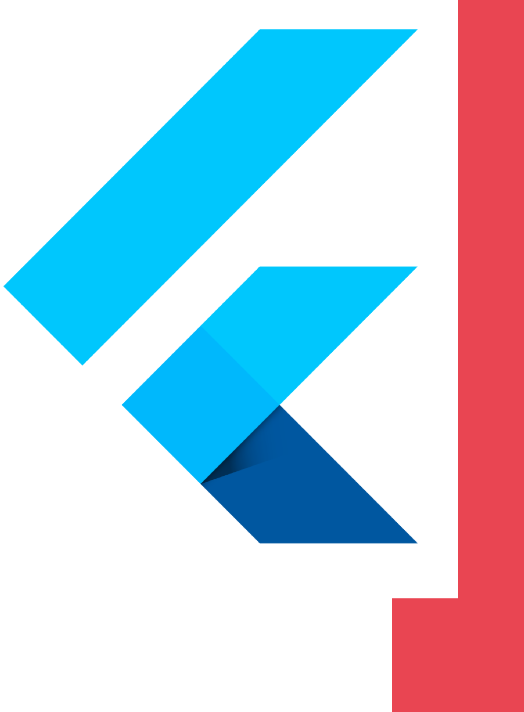
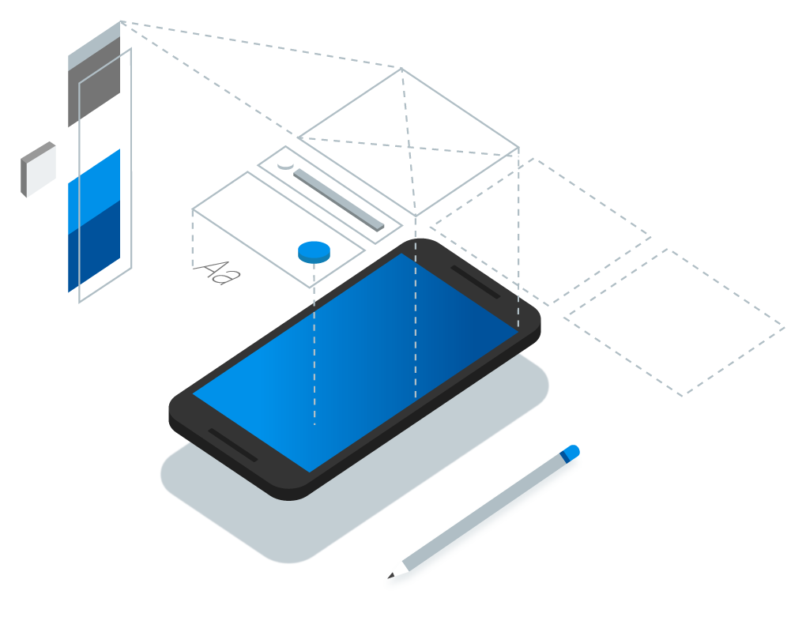
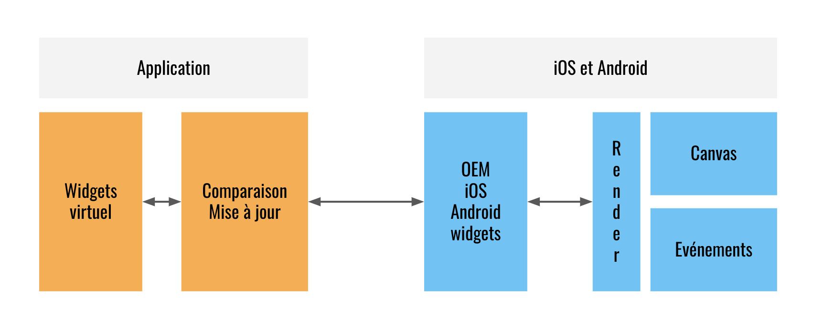
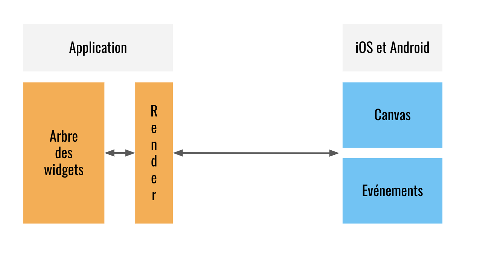
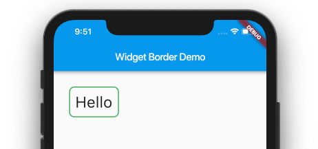
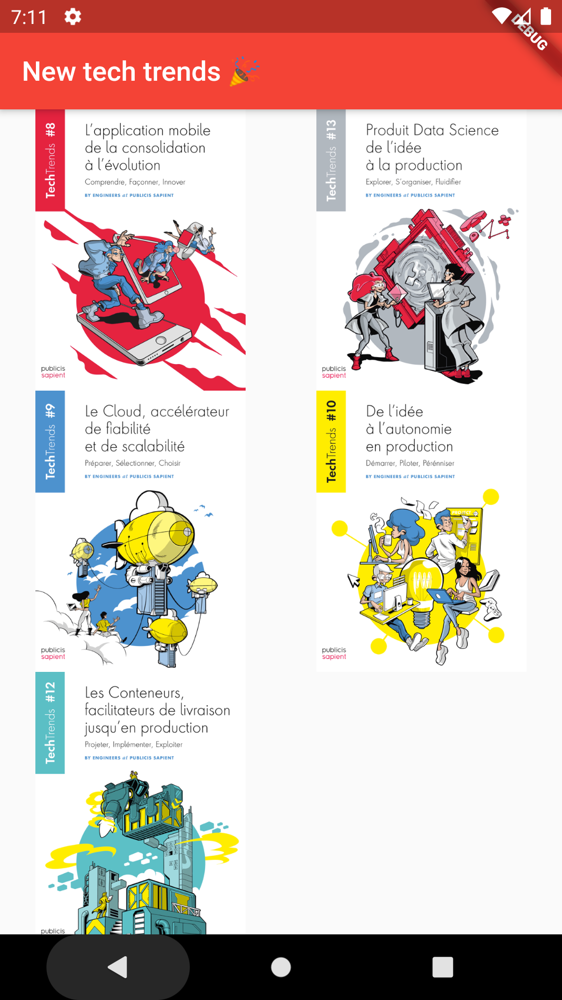
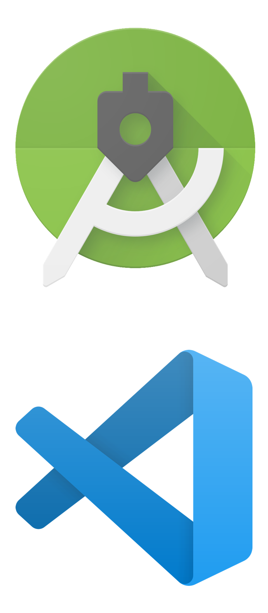
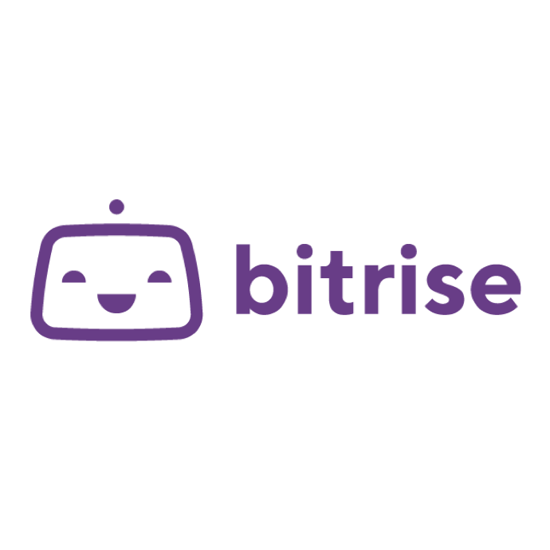
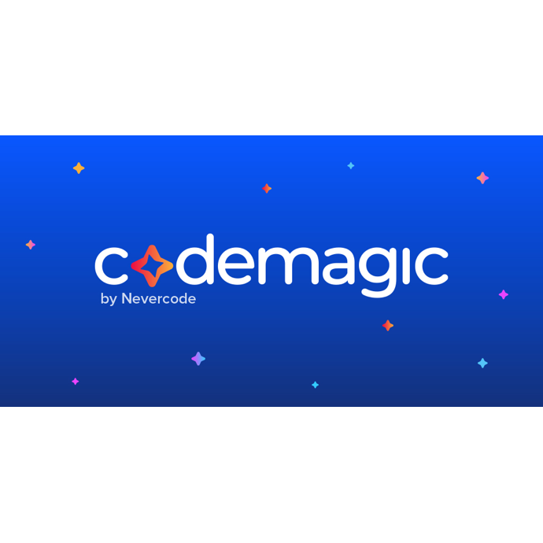

theme: XebiCon19
slidenumbers: true
slide-dividers: #
footer: XEBICON*19*
slide-transition: true

# Flutter en<br/>5 min ⏱



[.header: #000, alignment(left), line-height(1.0), text-scale(1.4), Roboto Black]

[.slidenumbers: false]

[.footer-style: #000, alignment(left), text-scale(1.6)]

# Benjamin Lacroix


Développeur *Android* (et Flutter) à *Xebia* depuis 6 ans

*@benjlacroix*

# Flutter

### Construire des apps *rapides*, *modernes* et *jolies*

* Framework `react-style` 
* Dart (Google)
* *Moteur 2D* (Skia)
* Bibliothèque de *widgets*
* Outillage



^
- Les composants sont mis à jour en fonction de l'écran, des événements de façon automatique, si quelque chose change, le composant change.
- Dart : VM & langage orienté objet, garbage collecté
- Skia (bibliothèque de rendu 2D)
- IDE, format de code, hot reload, SDK

# How *React Native*



# How *Flutter*



# Tout est *widget*

* Un *élément* (bouton, texte, menu)
* Le *style* (police, couleur)
* Un *aspect* du *format* (padding, margin)



# Widget



[.code-highlight: 1]

[.code-highlight: 6]

[.code-highlight: 7]

[.code-highlight: 8-10]

[.code-highlight: 11-16]

[.code-highlight: all]

```dart
class TechTrendsLibrary extends StatelessWidget {
  final List<TechTrend> techTrends = [
    TechTrend('tt-data.webp', 'Data'),
  ];
  @override
  Widget build(BuildContext context) {
    return Scaffold(
        appBar: AppBar(
          title: Text(this.title),
        ),
        body: GridView.count(
          crossAxisCount: 2,
          children: techTrends
                      .map((tt) => Image.network(tt.image))
                      .toList(),
        ));
  }
}
```

# IDE

* *Google* supporte
    * Android Studio
    * VSCode
    * La ligne de commande
    


# Tests

[.code-highlight: 3]

[.code-highlight: 4]

[.code-highlight: 8]

[.code-highlight: all]

```dart
void main() {
  final presenter = CartPresenter();
  group('get best offer', () {
    test('percent50 is best offer', () {
      final minus10 = Offer(OfferType.minus, 10, 0);
      final percent50 = Offer(OfferType.percentage, 50, 0);
      final bestOffer = presenter.getBestOffer([minus10, percent50], 100);
      expect(bestOffer, equals(percent50));
    });
  });
}
```

^
* Dart unit test
* Intégré à Android Studio
* Système d'assertions (~Jest)
* Framework comme Enzyme pour les composants

# CI & CD

 

# Take away

* Une *seule base* de code pour *iOS* & *Android*
* Du code *spécifique* pour... faire du *spécifique* 🤷‍♂️ 
* Développements *rapides*
* Outillage *avancé*

# <br/><br/><br/><br/><br/><br/><br/><br/>Flutter 🚀

@XebiConFr
\#XebiCon19

## Merci


[.background-color: #e94552]

[.text: #fff, Roboto Light]

[.text-emphasis: #fff, Roboto Black]

[.header: #fff, alignment(left), text-scale(1.1), Roboto Black]

[.footer-style: #fff, alignment(left), text-scale(1.6), Roboto Light]

[.slidenumber-style: #fff]
